<div align="center">


# 🏊 AquaGuard AI — Child Pool Safety System

**AI-powered pool monitoring camera that detects unsupervised children near water and sends WhatsApp alerts in real time. A supervision *assist* — not a replacement for an adult.**

[](https://python.org)
[](https://ultralytics.com)
[](https://universe.roboflow.com)
[](https://raspberrypi.com)
[](LICENSE)

*BUS61104 · Taylor's University Malaysia · Group 20 · April 2026*

</div>

---

## 🎬 Live Demo — Input vs Output

<table>
<tr>
<td align="center" width="50%">
<strong>📥 Raw Camera Frame (Input)</strong><br><br>
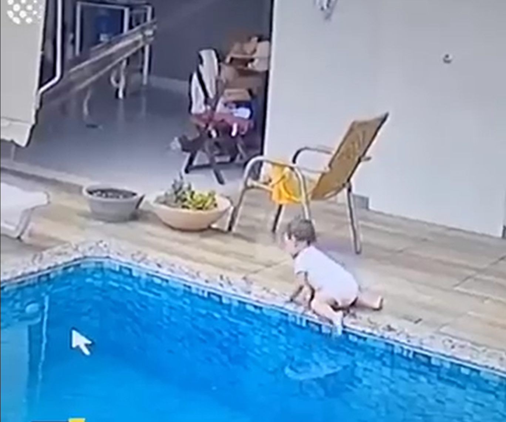
<br><em>Original frame — no processing</em>
</td>
<td align="center" width="50%">
<strong>📤 AquaGuard AI Output</strong><br><br>
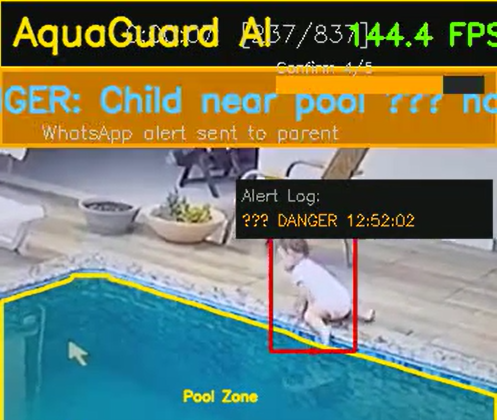
<br><em>Pool mask + child/adult detection + alert status</em>
</td>
</tr>
</table>

> 🟢 Green pool border = safe · 🟠 Orange = danger (child near pool, no adult) · 🔴 Red = emergency (child foot inside pool zone)

---

## 🚨 The Problem

<table>
<tr>
<td width="60%">

### Drowning is a silent crisis

- **236,000 people drown every year** globally (WHO, 2021)
- **440 Malaysians** died from drowning in 2022
- **74% of residential drownings** occur at private pools (CDC)
- Drowning is a leading cause of accidental death for children under 5
- Victims **cannot call for help** — drowning is silent and fast

### Why current solutions fall short

| Solution | Limitation |
|---|---|
| Pool fencing | Does not help once a child is already past it |
| Lifeguards | Not available at residential/condo pools |
| Wristband alarms | Requires the child to wear a device, often forgotten |
| Simple CCTV | Records but never alerts in real time |
| Commercial AI | USD 10,000–50,000 — built for Olympic/public pools |

</td>
<td width="40%" align="center">

### 🇲🇾 Malaysia Specifically

| Stat | Value |
|---|---|
| Drowning deaths 2022 | **440** |
| % at residential pools | **74%** |
| Condo units in Malaysia | **1.24 million** |
| Existing AI solutions | **RM 50,000+** |
| AquaGuard AI price | **RM 1,200** |

</td>
</tr>
</table>

---

## 💡 The Solution — AquaGuard AI

### Two-Level Alert System

| Level | Trigger | Action |
|---|---|---|
| 🟠 **DANGER** | Child in camera frame + no adult visible + pool detected | WhatsApp warning → Parent |
| 🔴 **EMERGENCY** | Child foot-point inside pool water polygon (confirmed 5 frames) | WhatsApp alert → Parent + 🔊 Siren |

### System Pipeline

```
Camera (30 FPS)
        ↓
Model 1 — YOLOv8m-seg ─────→ Detects pool water shape (irregular mask polygon)
        ↓
Model 2 — YOLOv9c ──────────→ Classifies every person: CHILD or ADULT
        ↓
  ┌─────────────────────────────────────────────────────────┐
  │  Child in frame + no adult + pool visible?               │
  │    YES → 🟠 DANGER  — WhatsApp to Parent                 │
  │                                                          │
  │  Child foot-point inside pool polygon (5-frame confirm)? │
  │    YES → 🔴 EMERGENCY — WhatsApp + Siren                 │
  └─────────────────────────────────────────────────────────┘
        ↓
  Alert delivered in < 3 seconds
```

> ⚠️ **Scope note:** EMERGENCY detects a child whose foot-point enters the pool **zone**. It is a *zone-intrusion* alert, not a clinical drowning detector. See [Honest Scope & Limitations](#-honest-scope--limitations).

---

## 🤖 Model 1 — Pool Segmentation

### Dataset

| Dataset | Source (Roboflow Universe) | Images | Classes | Annotation | License |
|---|---|---|---|---|---|
| **Pool Localisation** | [`ehsangooyahotmailcom-6xaas/pool-localisation`](https://universe.roboflow.com/ehsangooyahotmailcom-6xaas/pool-localisation) (v1) | **1,447** (train 1,266 / valid 121 / test 60) | 1 (`pool`) | Instance segmentation masks | CC BY 4.0 |

> Base set of ~603 source images expanded to 1,447 via Roboflow augmentation (applied to the train split only). Mean pool coverage ≈ 17.3% of frame.

<table>
<tr>
<td align="center" width="50%">
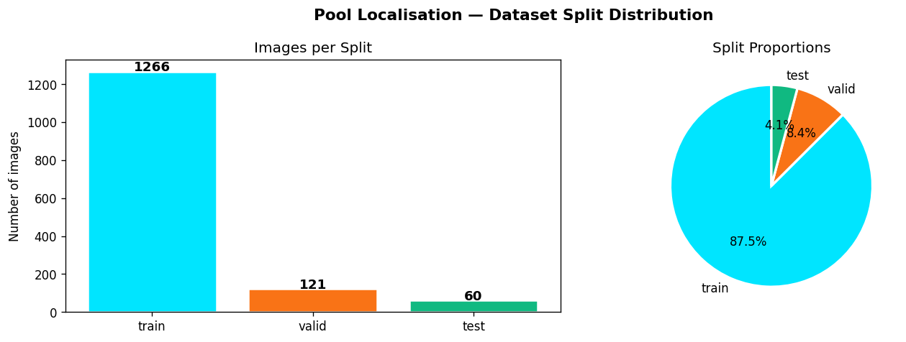
<br><em>Dataset split distribution — 1,447 total images</em>
</td>
<td align="center" width="50%">
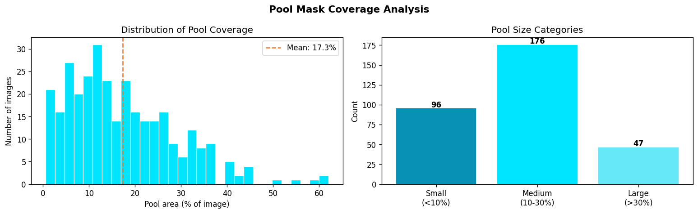
<br><em>Pool mask coverage analysis — mean 17.3% of frame</em>
</td>
</tr>
</table>

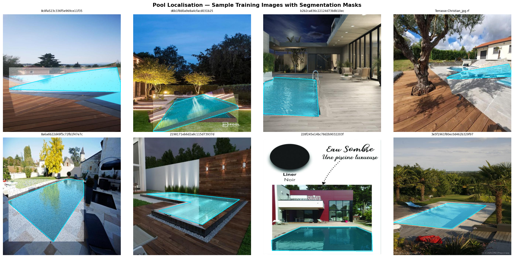

*Sample training images with segmentation masks — teal overlay shows annotated pool area*

### Training Results

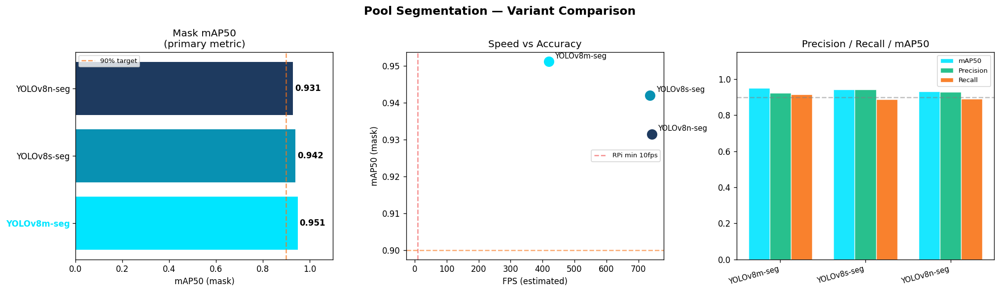

| Variant | mAP50 (mask) | mAP50-95 (mask) | Precision | Recall | FPS* | Winner |
|---|---|---|---|---|---|---|
| **YOLOv8m-seg** | **0.9512** | **0.7758** | 0.9225 | 0.9152 | 419.7 | ✅ |
| YOLOv8s-seg | 0.9420 | 0.7680 | 0.9429 | 0.8890 | 736.8 | |
| YOLOv8n-seg | 0.9315 | 0.7330 | 0.9278 | 0.8902 | 742.3 | |

> **Winner: YOLOv8m-seg** — highest mask mAP50 and mAP50-95, comfortably above the dataset's pre-validated 93.3% mAP50. Selection metric: mask mAP50 at FPS > 10. <br>*FPS measured on the training GPU (see [Pipeline Speed](#pipeline-speed)) — not deployment hardware.*

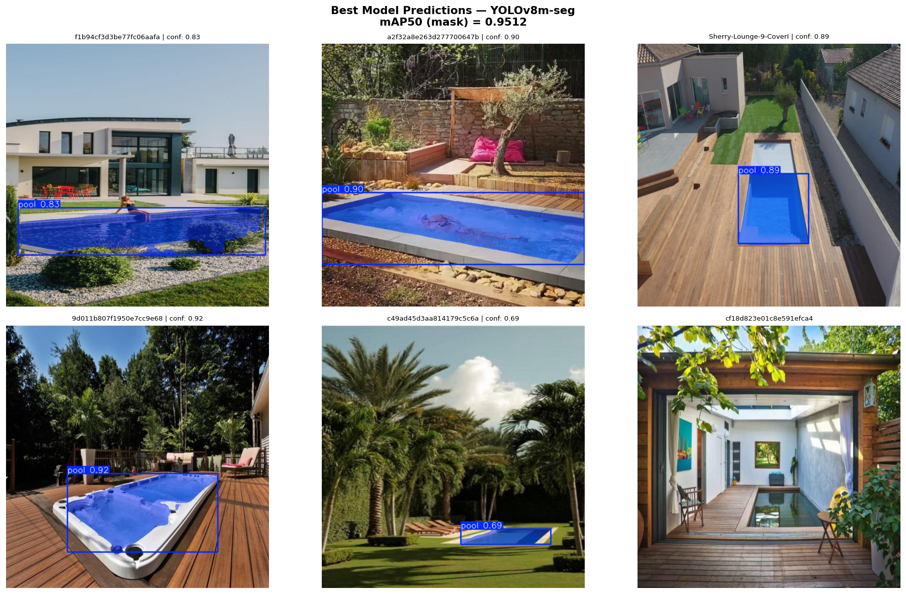

*Best model predictions on the validation set — actual irregular pool boundary detected*

---

## 👶 Model 2 — Child / Adult Detection

### Dataset

**Two Roboflow datasets merged into a unified 2-class problem** (`elderly` folded into `adult`, `null` annotations dropped; classes remapped **by name**, not index, to avoid label-swap):

| Dataset | Source (Roboflow Universe) | Images | Original classes |
|---|---|---|---|
| Child/Adult/Elderly | [`kpz2/child-adult-elderly`](https://universe.roboflow.com/kpz2/child-adult-elderly) (v2) | 3,749 | adult, child, **elderly → adult** |
| DIDI_CHILDV1 | [`thesis-7mcms/didi_childv1`](https://universe.roboflow.com/thesis-7mcms/didi_childv1) (v1) | 4,940 | adult, child |
| **Merged total** | — | **8,689** (train 6,739 / valid 1,309 / test 641) | **adult, child** |

Merged instance counts: child ≈ 32,242 · adult ≈ 25,652 (≈ 56% / 44%). Median bbox area: **child 0.31%** vs **adult 3.99%** of frame — children are small-object targets, which directly shapes the detection difficulty.

<table>
<tr>
<td align="center" width="50%">
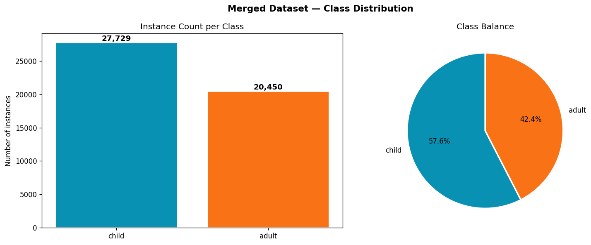
<br><em>Class distribution after merge — adult + child only</em>
</td>
<td align="center" width="50%">
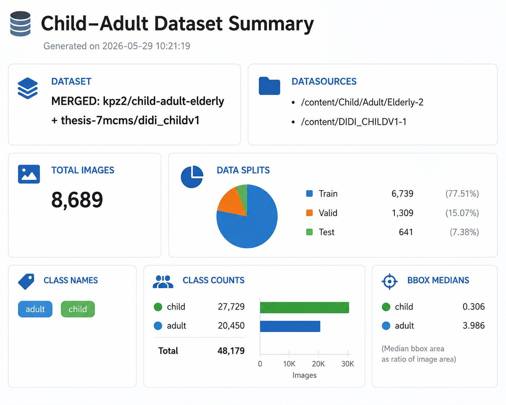
<br><em>Training images by source dataset</em>
</td>
</tr>
</table>

<table>
<tr>
<td align="center" width="50%">
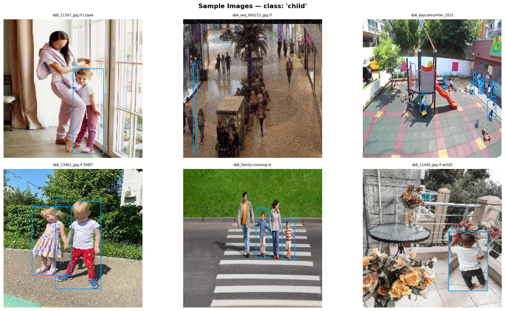
<br><em>Sample child images from merged dataset</em>
</td>
<td align="center" width="50%">
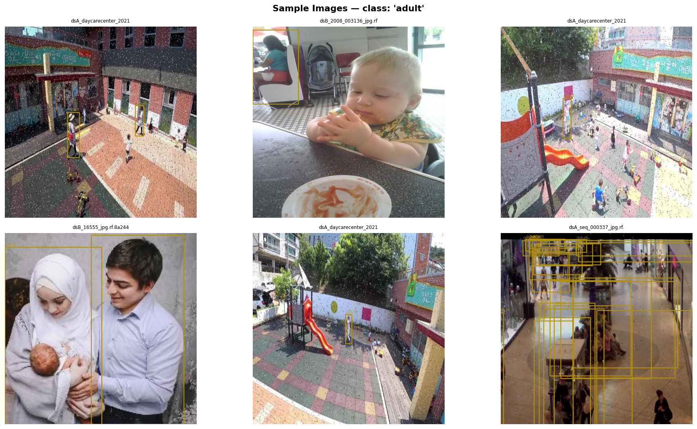
<br><em>Sample adult images from merged dataset</em>
</td>
</tr>
</table>

### Training Results

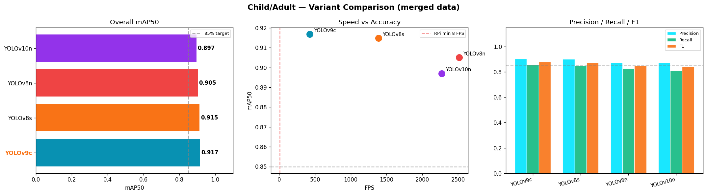

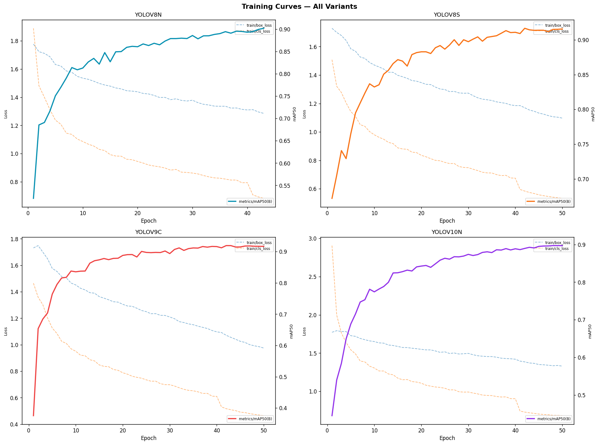

| Variant | mAP50 | mAP50-95 | **Child AP50** | Adult AP50 | Precision | Recall | FPS* | Winner |
|---|---|---|---|---|---|---|---|---|
| **YOLOv9c** | **0.9168** | 0.575 | **0.9224** | 0.9112 | 0.9046 | 0.8560 | 427.2 | ✅ |
| YOLOv8s | 0.9148 | 0.568 | 0.9162 | 0.9135 | 0.9005 | 0.8486 | 1387.0 | |
| YOLOv8n | 0.9050 | 0.544 | 0.9025 | 0.9075 | 0.8734 | 0.8269 | 2515.8 | |
| YOLOv10n | 0.8970 | 0.543 | 0.8928 | 0.9011 | 0.8736 | 0.8114 | 2272.2 | |

> **Winner: YOLOv9c** — highest Child AP50 (the selection metric, since missing a child is worse than a false alarm). The gap over YOLOv8s is small (0.9224 vs 0.9162); YOLOv9c was chosen for child detection, with YOLOv8s as the speed-friendly fallback. <br>*Metrics reported on the **validation** split; FPS measured on the training GPU.*

---

## 🔗 Master Pipeline — Combined System

### Pipeline on Test Images

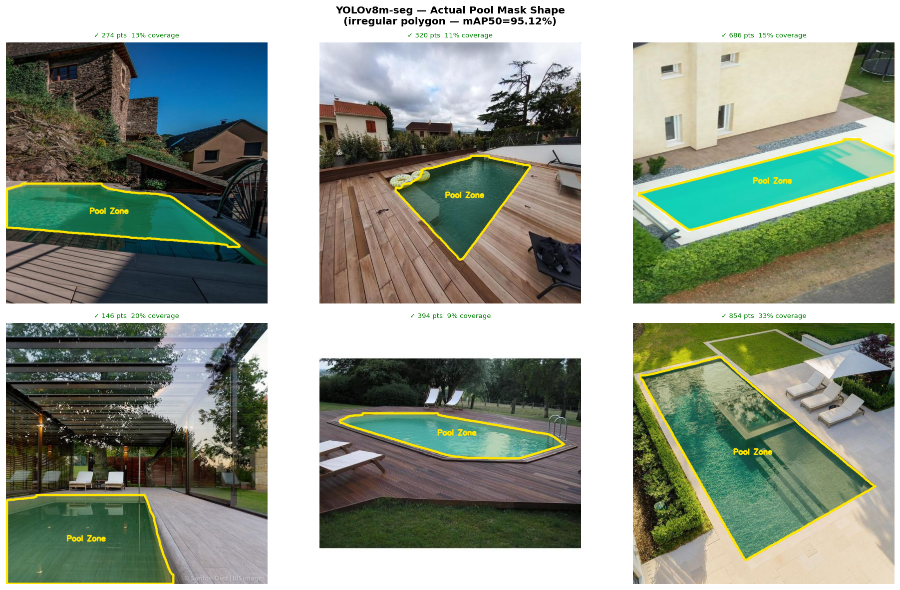

*Pool segmentation masks — actual irregular polygon following the real pool boundary*

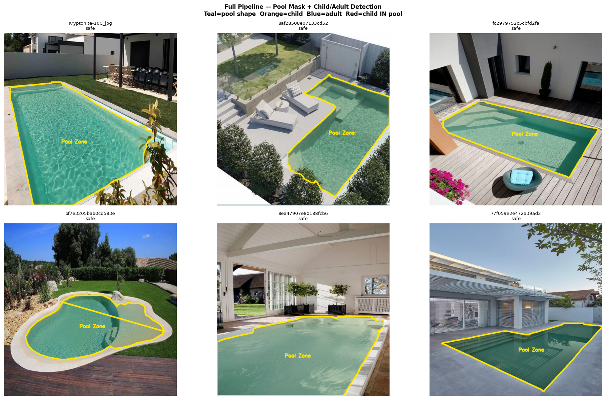

*Full pipeline: teal = pool zone · orange = child · blue = adult · red border = child inside pool*

### System Evaluation

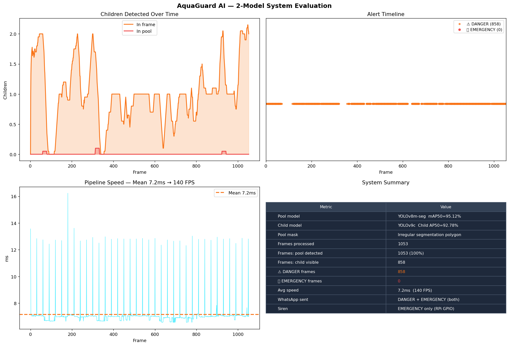

### Sample Output Frames

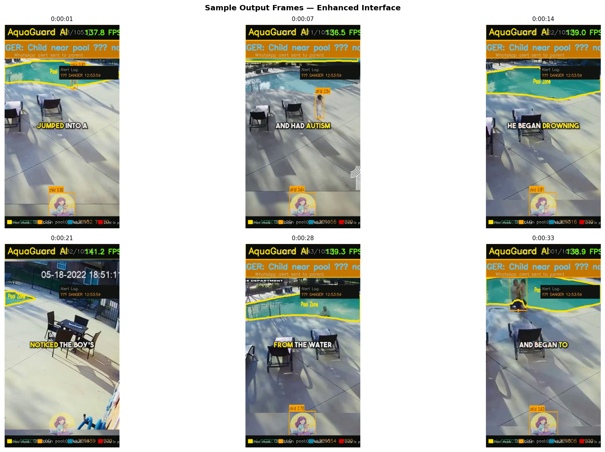

### Pipeline Speed

| Stage | Time | Notes |
|---|---|---|
| Model 1 — Pool Seg | ~4.9 ms | runs every **30 frames** (polygon cached between updates) |
| Model 2 — Child/Adult | ~5.5 ms | every frame |
| **Effective per frame** (seg amortized) | **~5.7–7.0 ms** | **→ ~145–175 FPS** |

> ⚙️ **Hardware honesty:** all FPS figures above were measured on the **training GPU (NVIDIA RTX PRO 6000 Blackwell, 96 GB)** — *not* the deployment target. They show the pipeline is not compute-bound, nothing more. <br> 📟 **Raspberry Pi 5 + Hailo-8L is a projection, not a measurement.** YOLOv9c (25.3 M params, 102 GFLOPs) → Hailo HEF compilation has **not yet been validated**; expect meaningfully lower throughput on a 26-TOPS edge accelerator. YOLOv8s/YOLOv8m compile more reliably and are the recommended edge fallback. Real on-device numbers will be published once measured.

---

## 🔬 Honest Scope & Limitations

For a child-safety system, being explicit about what it does **not** do is part of the design.

- **Supervision assist, not a substitute.** AquaGuard is an alerting aid. It does not replace adult supervision and is not a certified drowning-detection device.
- **Zone intrusion ≠ drowning.** EMERGENCY fires when a detected child's foot-point enters the pool polygon. A fully submerged or horizontal child produces an unreliable bounding box and may not be detected — the system is strongest at the *prevention* stage (child approaching/entering), not at detecting an in-progress submersion.
- **"Child" is partly a size cue.** The detector keys on apparent body size; a crouching adult or a tall older child can be misclassified. Reported AP50 is dominated by larger, frontal subjects — performance on small, overhead, far-from-camera children (the operational case) is lower.
- **Reported accuracy is on the validation split.** Held-out **test-split** evaluation and **size-stratified AP** (small/medium/large) are the next reporting step; treat current numbers as upper-bound estimates.
- **Domain gap.** Training images are largely stock/daycare photos, not overhead residential-pool camera angles. A small real-deployment evaluation set is needed to confirm field performance.
- **Alerting depends on connectivity.** WhatsApp delivery relies on Twilio + network; the <3 s figure is the in-app trigger latency, not a guaranteed end-to-end delivery time.

---

## 📦 Repository Structure

```
aquaguard-ai/
├── notebooks/
│   ├── 01_pool_segmentation.ipynb       ← Train YOLOv8m-seg (pool dataset)
│   ├── 02_child_adult_detection.ipynb   ← Train YOLOv9c (merged dataset)
│   └── 04_master_pipeline.ipynb         ← FINAL 2-model system + video test
├── src/                                 ← Deployment source code
├── deploy/                              ← RPi main.py + systemd service
├── scripts/
│   ├── download_models.py               ← Download weights from Drive
│   └── clear_notebooks.py               ← Clear outputs before push
├── results/
│   ├── model1_pool_seg/                 ← EDA + training + comparison figures
│   ├── model2_child_adult/              ← EDA + training + comparison figures
│   └── master/                          ← System evaluation figures
├── tests/
│   ├── input.png                        ← Raw input frame
│   └── output.png                       ← Annotated output frame
├── .env.example
├── requirements.txt
└── requirements_rpi.txt
```

---

## 🚀 Quick Start

### Google Colab (Training)

Run the notebooks in order:

```bash
# 1. Pool segmentation
notebooks/01_pool_segmentation.ipynb

# 2. Child/adult detection
notebooks/02_child_adult_detection.ipynb

# 3. Master pipeline + video test
notebooks/04_master_pipeline.ipynb
```

> 🔑 **Security:** all API keys (Roboflow) and credentials (Twilio) must be stored in **Colab Secrets / `.env`** and referenced by *name* — never hardcoded in notebook cells. Clear notebook outputs (`scripts/clear_notebooks.py`) before every commit.

### Raspberry Pi 5 (Deployment)

```bash
git clone https://github.com/khh4lid/aquaguard-ai
cd aquaguard-ai
pip install -r requirements_rpi.txt
python scripts/download_models.py    # pulls weights from Google Drive
cp .env.example .env
nano .env                            # fill in Twilio + phone numbers
python deploy/main.py                # start monitoring
```

### Download Model Weights

```bash
pip install gdown
python scripts/download_models.py
```

| Model | Variant | Size | Drive Link |
|---|---|---|---|
| Pool Segmentation | YOLOv8m-seg | 54.8 MB | [Drive link](https://drive.google.com/file/d/17aHZsdLLXvAG9C1nLzuUTPi9_rRorNDD/view?usp=sharing) |
| Child/Adult | YOLOv9c | ~104 MB | [Drive link](https://drive.google.com/file/d/1IGT9uFrJFYFJZy5CHxt72paOoMVPwbc1/view?usp=drive_link) |

---

## 📱 WhatsApp Alert Setup

```bash
# 1. Sign up at twilio.com (free sandbox)
# 2. Parent texts "join <word>" to +14155238886
# 3. Fill .env (values stored as secrets, never committed):
TWILIO_ACCOUNT_SID=ACxxxxxxxxxxxxxxxxxx
TWILIO_AUTH_TOKEN=xxxxxxxxxxxxxxxxxx
TWILIO_WHATSAPP_FROM=whatsapp:+14155238886
PARENT_WHATSAPP=whatsapp:+60XXXXXXXXX
```

---

## 💰 Business Case

| Metric | Value |
|---|---|
| Hardware (one-time) | **RM 1,200** |
| Monthly subscription | **RM 49 / month** |
| Customer LTV (3 years) | **RM 2,964** |
| Target market | 1.24M condo units (Malaysia) |
| SAM | RM 280 million |
| Nearest competitor | USD 10,000+ (commercial only) |
| AquaGuard advantage | **~10× cheaper, residential-first, offline-capable** |

---

## 🌍 SDG Alignment

| SDG | How AquaGuard contributes |
|---|---|
| **SDG 3** — Good Health & Well-Being | Reduces risk of child drowning through earlier alerting |
| **SDG 9** — Industry, Innovation & Infrastructure | Deploys edge AI in residential infrastructure |
| **SDG 11** — Sustainable Cities & Communities | Makes communities safer, reduces emergency burden |

---

## 🛠️ Built With

| Technology | Purpose |
|---|---|
| [Ultralytics YOLOv8/v9](https://ultralytics.com) | Object detection + segmentation |
| [Roboflow Universe](https://universe.roboflow.com) | Training datasets |
| [Twilio WhatsApp API](https://twilio.com) | Real-time alerts |
| [Raspberry Pi 5](https://raspberrypi.com) | Edge hardware |
| [Hailo-8L (26 TOPS)](https://hailo.ai) | AI accelerator |
| [OpenCV](https://opencv.org) | Video processing + HUD |
| [PyTorch](https://pytorch.org) | Model training |

---

<div align="center">

*AquaGuard AI — earlier alerts for safer pools. A supervision assist, not a substitute for an adult.*

**BUS61104 · Taylor's University Malaysia · Group 20 · April 2026**

</div>

