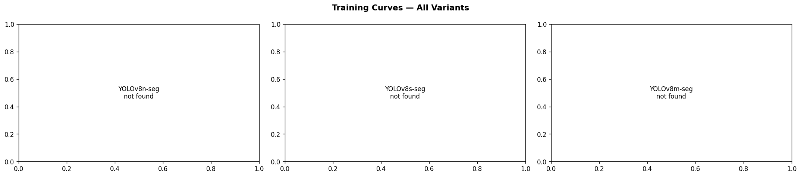

<div align="center">


# 🏊 AquaGuard AI — Child Pool Safety System

**AI-powered pool safety camera that detects unsupervised children and sends WhatsApp emergency alerts in real time.**

[](https://python.org)
[](https://ultralytics.com)
[](https://universe.roboflow.com)
[](https://raspberrypi.com)
[](LICENSE)

*BUS61104 · Taylor's University Malaysia · Group 20 · April 2026*

</div>

---

## 🎬 Live Demo — Input vs Output

<table>
<tr>
<td align="center" width="50%">
<strong>📥 Raw Camera Frame (Input)</strong><br><br>

<br><em>Original frame — no processing</em>
</td>
<td align="center" width="50%">
<strong>📤 AquaGuard AI Output</strong><br><br>

<br><em>Pool mask + child/adult detection + alert status</em>
</td>
</tr>
</table>

> 🟢 Green pool border = safe · 🟠 Orange = danger (child near pool, no adult) · 🔴 Red = emergency (child in water)

---

## 🚨 The Problem

<table>
<tr>
<td width="60%">

### Drowning is a silent crisis

- **236,000 people drown every year** globally (WHO, 2021)
- **440 Malaysians** died from drowning in 2022
- **74% of residential drownings** occur at private pools (CDC)
- Drowning is the **#1 cause of accidental death** for children under 5
- Victims **cannot call for help** — drowning is silent and fast

### Why current solutions fail

| Solution | Problem |
|---|---|
| Pool fencing | Does not help once child is already in water |
| Lifeguards | Not available at residential/condo pools |
| Wristband alarms | Requires child to wear device, often forgotten |
| Simple CCTV | Records but never alerts in real time |
| Commercial AI | USD 10,000–50,000 — designed for Olympic pools only |

</td>
<td width="40%" align="center">

### 🇲🇾 Malaysia Specifically

| Stat | Value |
|---|---|
| Drowning deaths 2022 | **440** |
| % at residential pools | **74%** |
| Condo units in Malaysia | **1.24 million** |
| Existing AI solutions | **RM 50,000+** |
| AquaGuard AI price | **RM 1,200** |

</td>
</tr>
</table>

---

## 💡 The Solution — AquaGuard AI

<table>
<tr>
<td align="center">

### Two-Level Alert System

</td>
</tr>
</table>

| Level | Trigger | Action |
|---|---|---|
| 🟠 **DANGER** | Child in camera frame + no adult visible + pool detected | WhatsApp warning → Parent |
| 🔴 **EMERGENCY** | Child foot-point inside pool water polygon | WhatsApp alert → Parent + 🔊 Siren |

### System Pipeline

```
Camera (30 FPS)
        ↓
Model 1 — YOLOv8m-seg ─────→ Detects pool water shape (irregular mask polygon)
        ↓
Model 2 — YOLOv9c ──────────→ Classifies every person: CHILD or ADULT
        ↓
  ┌─────────────────────────────────────────────────────────┐
  │  Child in frame + no adult + pool visible?              │
  │    YES → 🟠 DANGER  — WhatsApp to Parent               │
  │                                                         │
  │  Child foot inside pool polygon?                        │
  │    YES → 🔴 EMERGENCY — WhatsApp + Siren               │
  └─────────────────────────────────────────────────────────┘
        ↓
  Alert delivered in < 3 seconds
```

---

## 🤖 Model 1 — Pool Segmentation

### Dataset Overview

<table>
<tr>
<td align="center" width="50%">

<br><em>Dataset split distribution — 1,447 total images</em>
</td>
<td align="center" width="50%">

<br><em>Pool mask coverage analysis — mean 17.3% of frame</em>
</td>
</tr>
</table>


*Sample training images with segmentation masks — teal overlay shows annotated pool area*

### Training Results




### Model Comparison

| Variant | mAP50 (mask) | Precision | Recall | FPS | Winner |
|---|---|---|---|---|---|
| **YOLOv8m-seg** | **0.9512** | 0.9225 | 0.9152 | 419.7 | ✅ |
| YOLOv8s-seg | 0.9420 | 0.9429 | 0.8890 | 736.8 | |
| YOLOv8n-seg | 0.9315 | 0.9278 | 0.8902 | 742.3 | |

> **Winner: YOLOv8m-seg** — highest mask mAP50 at acceptable speed. Beats pre-validated benchmark of 93.3%.


*Best model predictions on validation set — actual irregular pool boundary detected*

---

## 👶 Model 2 — Child / Adult Detection

### Dataset Overview

**Two datasets merged — elderly class folded into adult:**

| Dataset | Source | Images | Classes |
|---|---|---|---|
| Child/Adult/Elderly | `kpz2/child-adult-elderly` | 3,749 | adult, child |
| DIDI_CHILDV1 | `thesis-7mcms/didi_childv1` | 4,940 | adult, child |
| **Merged total** | — | **8,689** | **adult, child** |

<table>
<tr>
<td align="center" width="50%">

<br><em>Class distribution after merge — adult + child only</em>
</td>
<td align="center" width="50%">

<br><em>Training images by source dataset</em>
</td>
</tr>
</table>

<table>
<tr>
<td align="center" width="50%">

<br><em>Sample child images from merged dataset</em>
</td>
<td align="center" width="50%">

<br><em>Sample adult images from merged dataset</em>
</td>
</tr>
</table>

### Training Results


### Model Comparison

| Variant | mAP50 | Child AP50 | Adult AP50 | Recall | FPS | Winner |
|---|---|---|---|---|---|---|
| **YOLOv9c** | **0.8395** | **0.9278** | 0.8908 | 0.8005 | 375.8 | ✅ |
| YOLOv8s | 0.8366 | 0.9111 | 0.8912 | 0.7751 | 1324.4 | |
| YOLOv8n | 0.8292 | 0.8987 | 0.8769 | 0.7555 | 2286.1 | |
| YOLOv10n | 0.8124 | 0.8970 | 0.8614 | 0.7430 | 2678.5 | |

> **Winner: YOLOv9c** — highest child AP50. Missing a child is never acceptable — child recall is the critical metric.

---

## 🔗 Master Pipeline — Combined System

### Pipeline on Test Images


*Pool segmentation masks — actual irregular polygon following real pool boundary*


*Full pipeline: teal = pool zone · orange = child · blue = adult · red border = child inside pool*

### System Evaluation


### Sample Output Frames


### Pipeline Speed

| Stage | Time | Contribution |
|---|---|---|
| Model 1 — Pool Seg (every 25 frames) | ~2.4ms | — |
| Model 2 — Child/Adult | ~5.5ms | 66% |
| **Total per frame (GPU)** | **~8.4ms** | **→ 118 FPS** |
| Estimated RPi 5 + Hailo-8L | ~25ms | → ~40 FPS |

---

## 📦 Repository Structure

```
aquaguard-ai/
├── notebooks/
│   ├── 01_pool_segmentation.ipynb       ← Train YOLOv8m-seg
│   ├── 02_child_adult_detection.ipynb   ← Train YOLOv9c (merged dataset)
│   └── 04_master_pipeline.ipynb         ← FINAL system + video deployment
├── src/                                 ← Deployment source code
├── deploy/                              ← RPi main.py + systemd service
├── scripts/
│   ├── download_models.py               ← Download weights from Drive
│   └── clear_notebooks.py              ← Clear outputs before push
├── results/
│   ├── model1_pool_seg/                 ← EDA + training + comparison figures
│   ├── model2_child_adult/              ← EDA + training + comparison figures
│   └── master_final/                    ← System evaluation figures
├── tests/
│   ├── input.png                        ← Raw input frame
│   └── output.png                       ← Annotated output frame
├── .env.example
├── requirements.txt
└── requirements_rpi.txt
```

---

## 🚀 Quick Start

### Google Colab (Training)

Run notebooks in order:

```bash
# 1. Pool segmentation
notebooks/01_pool_segmentation.ipynb

# 2. Child/adult detection
notebooks/02_child_adult_detection.ipynb

# 3. Master pipeline + video test
notebooks/04_master_pipeline.ipynb
```

### Raspberry Pi 5 (Deployment)

```bash
git clone https://github.com/khh4lid/aquaguard-ai
cd aquaguard-ai
pip install -r requirements_rpi.txt
python scripts/download_models.py    # pulls weights from Google Drive
cp .env.example .env
nano .env                            # fill in Twilio + phone numbers
python deploy/main.py                # start monitoring
```

### Download Model Weights

```bash
pip install gdown
python scripts/download_models.py
```

| Model | Variant | Size | Drive Link |
|---|---|---|---|
| Pool Segmentation | YOLOv8m-seg | 54.8 MB | ← *[Drive link](https://drive.google.com/file/d/17aHZsdLLXvAG9C1nLzuUTPi9_rRorNDD/view?usp=sharing)* |
| Child/Adult | YOLOv9c | ~104 MB | ← *[Drive link](https://drive.google.com/file/d/1IGT9uFrJFYFJZy5CHxt72paOoMVPwbc1/view?usp=drive_link)* |

---

## 📱 WhatsApp Alert Setup

```bash
# 1. Sign up at twilio.com (free sandbox)
# 2. Parent texts "join <word>" to +14155238886
# 3. Fill .env:
TWILIO_ACCOUNT_SID=ACxxxxxxxxxxxxxxxxxx
TWILIO_AUTH_TOKEN=xxxxxxxxxxxxxxxxxx
PARENT_WHATSAPP=whatsapp:+60XXXXXXXXX
```

---

## 💰 Business Case

| Metric | Value |
|---|---|
| Hardware (one-time) | **RM 1,200** |
| Monthly subscription | **RM 49 / month** |
| Customer LTV (3 years) | **RM 2,964** |
| Target market | 1.24M condo units (Malaysia) |
| SAM | RM 280 million |
| Nearest competitor | USD 10,000+ (commercial only) |
| AquaGuard advantage | **10× cheaper, residential-first, offline** |

---

## 🌍 SDG Alignment

| SDG | How AquaGuard contributes |
|---|---|
| **SDG 3** — Good Health & Well-Being | Directly prevents child drowning deaths |
| **SDG 9** — Industry, Innovation & Infrastructure | Deploys edge AI in residential infrastructure |
| **SDG 11** — Sustainable Cities & Communities | Makes communities safer, reduces emergency burden |

---

## 🛠️ Built With

| Technology | Purpose |
|---|---|
| [Ultralytics YOLOv8/v9](https://ultralytics.com) | Object detection + segmentation |
| [Roboflow Universe](https://universe.roboflow.com) | Training datasets |
| [Twilio WhatsApp API](https://twilio.com) | Emergency alerts |
| [Raspberry Pi 5](https://raspberrypi.com) | Edge hardware |
| [Hailo-8L (26 TOPS)](https://hailo.ai) | AI accelerator |
| [OpenCV](https://opencv.org) | Video processing + HUD |
| [PyTorch / HuggingFace](https://pytorch.org) | Model training |

---

<div align="center">

*AquaGuard AI — Saving lives with edge AI. Every second counts.*

**BUS61104 · Taylor's University Malaysia · Group 20 · April 2026**

</div>

